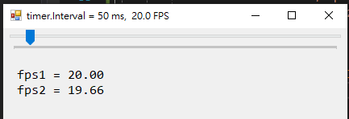

# FPSTool.cs

## Example

```c#
FPSTool fpsTool = new FPSTool();
```

```c#
// fixed time frame number method
double fps1 = fpsTool.FPS();
```

```c#
// the average sampling time method
double fps2 = fpsTool.FPS(10);
```




# _ (┐「ε:) _

